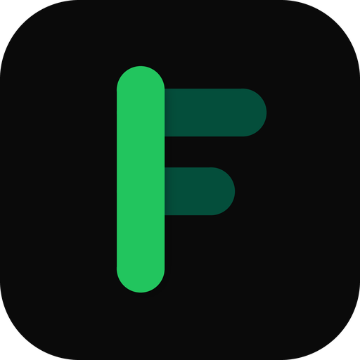

# FinVest - NextGen Finance Platform

<div align="center">
  
  <h3>Industry-Grade Personal Finance Management</h3>
  <p>Engineered for the Modern Professional</p>
</div>

---

## 🚀 Overview
FinVest is a high-performance, full-stack financial command center designed to give users unprecedented control over their personal economics. 
Built with a cutting-edge tech stack and featuring a stunning neo-brutalist dark mode aesthetic, FinVest moves beyond simple budgeting by integrating AI-powered receipt scanning, global multi-currency support, and granular tactical telemetry.

### ✨ Key Features
* **Hybrid Authentication**: Enterprise-grade dual login system featuring instant Google OAuth 2.0 integration alongside secure, hashed Email/Password credentials.
* **Native PWA Support**: Fully installable Progressive Web App (PWA) with generated manifest, Service Worker offline caching, and flawlessly anti-aliased geometry icons.
* **60fps GPU Acceleration**: UI animations and structural layout rendering are forcefully routed through hardware GPU acceleration for a buttery-smooth desktop and mobile experience.
* **Global Currency Engine**: Real-time cross-platform currency scaling using live exchange rates via `open.er-api.com`.
* **AI Receipt Splitter**: Upload a receipt and our ML vision engine instantly digitizes line items, allowing you to easily assign fractional shares to friends.
* **Tactical Command Center**: Deep-dive analytics, interactive pacing metrics, burn rate calculations, and dynamic re-calibration of your budget limits.

---

## 🛠 Tech Stack
**Frontend (Client Node)**
* **Framework**: Next.js 16 (App Router) + React 19
* **Styling**: Tailwind CSS + Custom Neo-brutalist Tokens
* **PWA**: `@ducanh2912/next-pwa` (Webpack worker optimized)
* **Animations**: Framer Motion
* **Charting**: Recharts
* **Icons**: Lucide React

**Backend (Core Server)**
* **Language**: Python 3.10
* **Framework**: Flask + Werkzeug
* **Database**: Supabase (PostgreSQL)
* **Auth**: Google Auth Library + Werkzeug Security Hashing
* **AI**: Google Generative AI (Vision OCR)

---

## ⚙️ Environment Configuration
To run this project locally, ensure you have a `.env` file in your `/backend` directory containing:

```env
# Database
SUPABASE_URL=your_supabase_url
SUPABASE_KEY=your_supabase_service_key

# Security
JWT_SECRET=your_jwt_secret
SECRET_KEY=your_flask_secret_key

# AI Vision
GEMINI_API_KEY=your_gemini_api_key

# Google OAuth
GOOGLE_CLIENT_ID=your_google_client_id
```

*Note: For frontend, create a `.env.local` inside `/frontend` containing `NEXT_PUBLIC_API_URL=http://localhost:5000` (or your live Render URL).*

---

## 📦 Local Development

**1. Clone the repository**
```bash
git clone https://github.com/Dhairya2112/FinVest-Financial-Buddy.git
cd FinVest-Financial-Buddy
```

**2. Start the Backend Server**
```bash
cd backend
python -m venv venv
source venv/bin/activate  # On Windows: venv\Scripts\activate
pip install -r requirements.txt
python app.py
```
*Server runs on `http://localhost:5000`*

**3. Start the Frontend Application**
```bash
cd frontend
npm install
npm run dev
```
*Client runs on `http://localhost:3000`*

---

## 🌐 Production Deployment

### 1. Frontend (Vercel)
FinVest is optimized for one-click Vercel deployments. 
1. Link your GitHub repository in the Vercel dashboard.
2. The framework will automatically be detected as Next.js.
3. **Important**: The build command is explicitly overridden to `next build --webpack` to ensure stable PWA Service Worker generation on Next.js 16.
4. Deploy!

### 2. Backend (Render)
The Flask backend is configured for deployment on Render via WSGI.
1. Connect your GitHub repository to a new Render Web Service.
2. **Build Command**: `pip install -r requirements.txt`
3. **Start Command**: `gunicorn app:app`
4. Add all environment variables from your `.env` to the Render dashboard.

---

## 👨‍💻 Created By
**Dhairya Dave** 
*Architect & Lead Developer*
